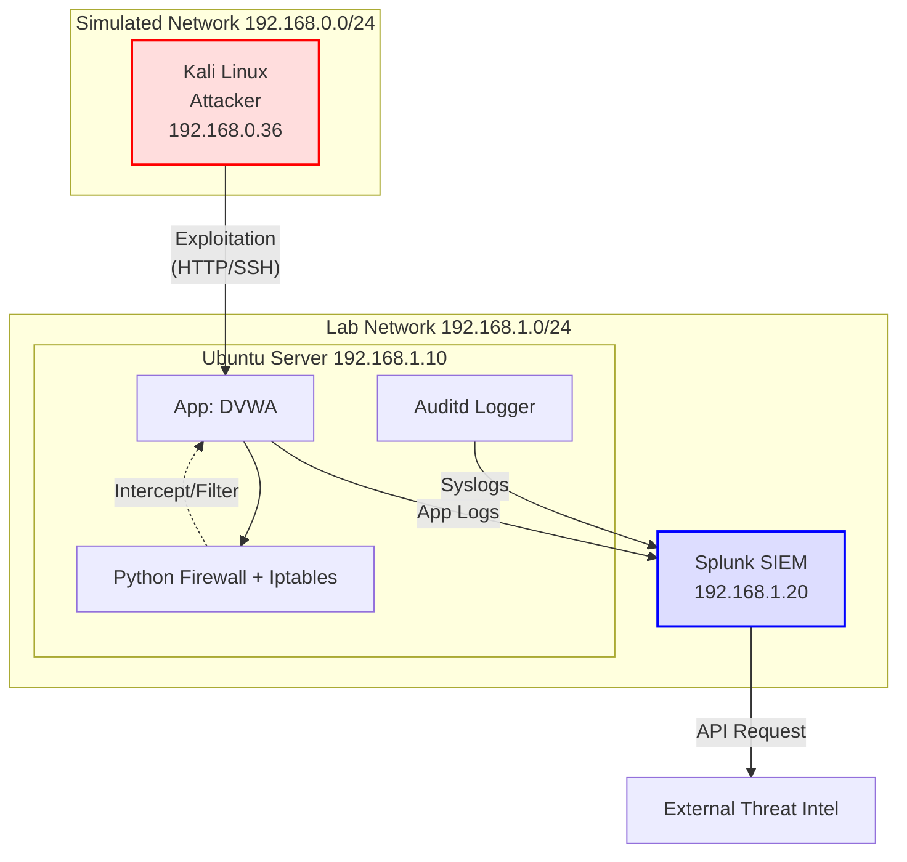

# 🏗️ Arquitectura del Laboratorio (SOC Lab)

Este documento detalla la estructura lógica y física de mi entorno de pruebas de ciberseguridad.

## 🗺️ Diagrama de Arquitectura

## 📋 Componentes

### 1. Zona de Ataque (Red Externa)
*   **Kali Linux:** Máquina virtual utilizada como nodo de ataque para simular vectores reales (Fuerza bruta, escaneos, fuzzing web).

### 2. Zona de Defensa (Red del Laboratorio)
*   **Ubuntu Server (Víctima):** Aloja la aplicación vulnerable (**DVWA**).
    *   **Firewall Personalizado:** Script de Python que interactúa con `iptables` para bloqueo estático y detección de anomalías.
    *   **Auditd:** Monitoreo de actividad a nivel del sistema operativo.
*   **Splunk SIEM:** Servidor centralizado para la ingesta y análisis de logs (`Syslogs` del sistema y logs de aplicación).
    *   Utiliza consultas (SPL) para la detección de comportamientos sospechosos y alertas.
    *   Integración con fuentes externas para Threat Intelligence.

---
*Documentación creada para dar contexto al flujo de trabajo del SOC Lab.*
