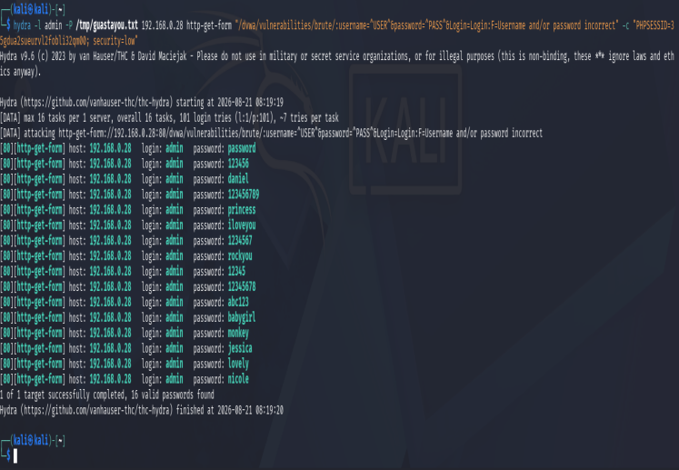
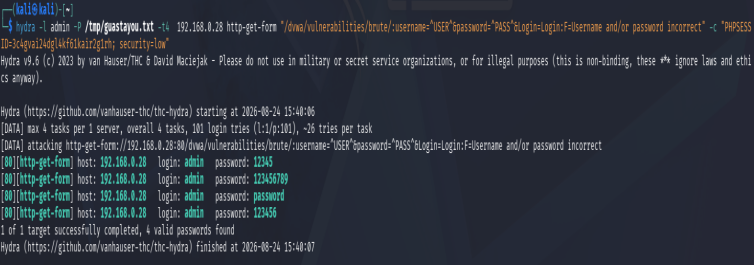
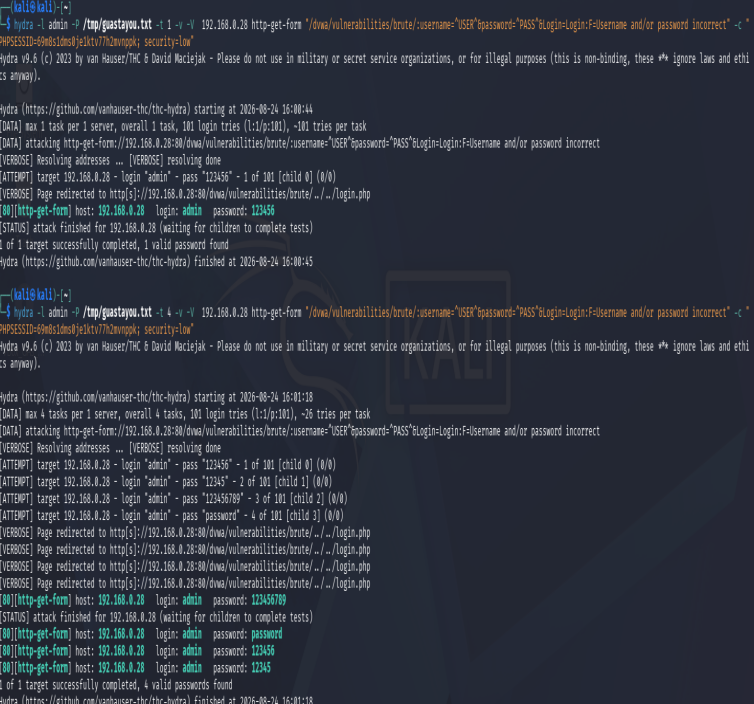
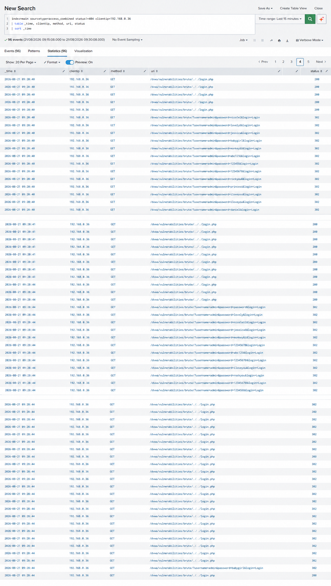
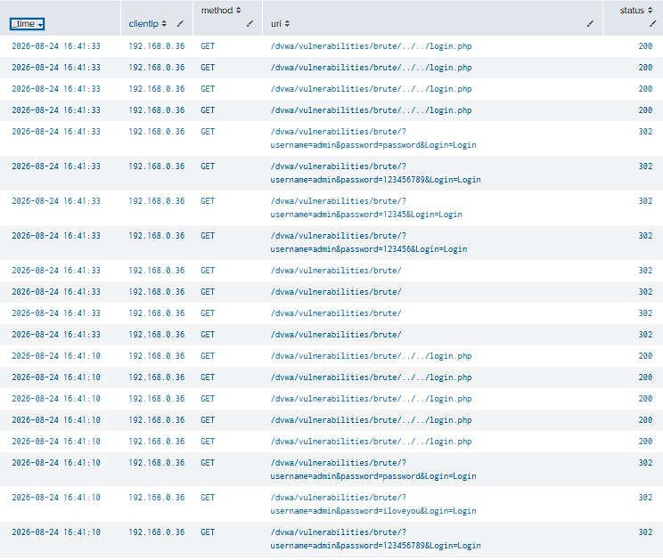
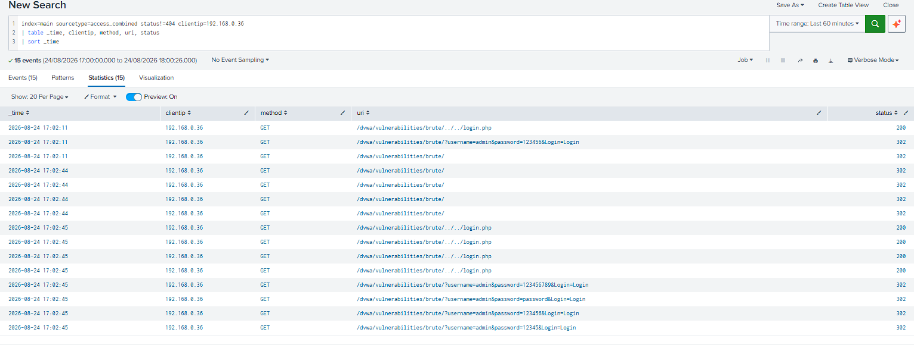

1 Brute Force contra el login de DVWA
   2
   3 Ataque de fuerza bruta con Hydra contra el módulo **Brute Force** de DVWA (nivel
     de seguridad Low) —
   4
   5 ## Comando base utilizado
  hydra -l admin -P /tmp/guastayou.txt 192.168.0.28 http-get-form \
  "/dvwa/vulnerabilities/brute/:username=^USER^&password=^PASS^&Login=Login:F=Usernam
  e and/or password incorrect" \
  -c "PHPSESSID=<valor>; security=low"

    1
    2 - `http-get-form` → módulo de Hydra para atacar formularios de login enviados
      por GET
    3 - `F=Username and/or password incorrect` → texto que Hydra usa para reconocer
      un intento fallido
    4 - `-c "PHPSESSID=...; security=low"` → cookie de sesión necesaria, porque DVWA
      requiere una sesión activa para procesar el formulario
    5
    6 Se realizaron **tres intentos** de este ataque, ajustando parámetros entre cada
      uno para tratar de eliminar los falsos positivos que aparecían en el resultado.
    7
    8 ## Intento 1 — Ataque básico
    9
   10 Primer intento, con la wordlist completa (5000 contraseñas + `password` al
      final) y la cookie de sesión inicial, sin ajustes adicionales.
   11
   12 
   13
   14 **Resultado:** Hydra marcó **16 contraseñas como válidas** — un número
      imposible para un solo usuario con una sola contraseña real, señal clara de
      falsos positivos.
   15
   16 ## Intento 2 — Ajuste de timeout de sesión y concurrencia (`-t`)
   17
   18 Se planteó la hipótesis de que la sesión de DVWA expiraba a mitad del ataque,
      haciendo que Hydra perdiera de vista el mensaje de error esperado. Se aplicaron
      dos cambios:
   19
   20 - Se aumentó `session.gc_maxlifetime` a `3600` en `php.ini`, para extender la
      duración de la sesión
   21 - Se relanzó el ataque probando distintos valores de concurrencia (`-t 1`, `-t
      2`, `-t 3`), con una cookie de sesión renovada en cada corrida
   22
   23 
   24
   25 **Resultado:** el número de falsos positivos bajó de 16 a un rango de **1 a
      4**, pero seguía sin ser el resultado limpio esperado (1 sola contraseña
      válida). Se observó además un patrón: la cantidad de falsos positivos escalaba
      junto con el valor de `-t` usado (más threads simultáneos → más falsos
      positivos), y todos correspondían a las primeras contraseñas del wordlist, no a
      posiciones aleatorias.
  ┌──────────────┬─────────────────────────────────────┐
  │ Threads (-t) │ Contraseñas marcadas como "válidas" │
  ├──────────────┼─────────────────────────────────────┤
  │ -t 1         │ 123456                              │
  │ -t 2         │ 123456, 12345                       │
  │ -t 3         │ 12345, 123456, 123456789            │
  └──────────────┴─────────────────────────────────────┘

   1
   2 ## Intento 3 — Modo debug (`-v -V`)
   3
   4 Para intentar identificar la causa exacta, se relanzó el ataque con `-t 1` y las
     flags `-v -V`, que muestran en pantalla cada intento y la respuesta del servidor
     en tiempo real:
  hydra -l admin -P /tmp/guastayou.txt -t 1 -v -V 192.168.0.28 http-get-form \
  "/dvwa/vulnerabilities/brute/:username=^USER^&password=^PASS^&Login=Login:F=Usernam
  e and/or password incorrect" \
  -c "PHPSESSID=<valor>; security=low"

    1
    2 
    3
    4 **Resultado:** con concurrencia mínima (`-t 1`) y visibilidad completa del
      proceso, Hydra encontró **una sola contraseña válida** — el comportamiento
      correcto y esperado.
    5
    6 ## Verificación manual
    7
    8 Se probó cada contraseña marcada como "válida" en los tres intentos,
      directamente en el navegador. **Solo `password`** (la contraseña real de
      `admin` en DVWA) permitió el login efectivamente en todos los casos. El resto
      (`12345`, `123456`, `123456789`, y las 16 del primer intento) resultaron
      **falsos positivos**.
    9
   10 ## Conclusión de la investigación
   11
   12 El patrón observado entre los tres intentos — el número de falsos positivos cae
      a medida que baja la concurrencia, hasta desaparecer por completo con `-t 1` —
      indica que la causa está relacionada con **el manejo de sesión de PHP bajo
      múltiples requests simultáneos**, no con expiración por tiempo (el ajuste de
      `session.gc_maxlifetime` no tuvo efecto por sí solo). Con varios threads
      atacando la misma `PHPSESSID` al mismo tiempo, el servidor parece devolver
      respuestas inconsistentes en los primeros intentos, antes de estabilizarse —
      probablemente por cómo PHP bloquea el archivo de sesión ante accesos
      concurrentes al mismo identificador. No se profundizó más allá de este punto
      por estar fuera del alcance del ejercicio.
   13
   14
   15 ## Detección en Splunk
  index=main sourcetype=access_combined uri="*brute*" clientip=<IP_KALI>
  | table _time, method, uri, status
  | sort _time

    1
    2 A diferencia de SSH (que distingue `Failed password` / `Accepted password` como
      eventos separados), **HTTP no distingue éxito o fracaso de autenticación a
      nivel de protocolo** — todos los requests devuelven status `200` (la página
      siempre carga), haya acertado la contraseña o no. Por eso, para detectar este
      tipo de ataque en logs web, la señal no está en el `status`, sino en el
      **volumen de requests a la misma ruta desde la misma IP en poco tiempo** — el
      mismo principio de detección que se usó para SSH, adaptado a que acá el
      criterio de "éxito" no es visible en el código de respuesta.
    3
    4 A continuación se muestran los reportes de Splunk para cada intento:
    5
    6 1. **Intento 1 (Básico):** Se aprecia el alto volumen de peticiones y los
      falsos positivos detectados.
    7 
    8
    9 2. **Intento 2 (Ajustado):** Se observa una reducción en el volumen de
      peticiones, pero aún persisten falsos positivos debido a la concurrencia.
   10 
   11
   12 3. **Intento 3 (Debug):** Con el ajuste final, el reporte de Splunk muestra un
      ataque limpio, sin falsos positivos, correlacionando con el resultado exitoso
      de Hydra.
   13 
   14
   15
   16 ## Resumen
  ┌───────────────┬───────────────────────────────────────┬───────────┐
  │ Intento       │ Ajuste aplicado                       │ Falsos    │
  │               │                                       │ positivos │
  ├───────────────┼───────────────────────────────────────┼───────────┤
  │ 1 — Básico    │ Ninguno                               │ 16        │
  │ 2 — Timeout + │ session.gc_maxlifetime=3600, variando │ 1 a 4     │
  ┌──────────────────┬─────────────────────────────────────────────────────────┐
  │ Campo            │ Valor                                                   │
  ├──────────────────┼─────────────────────────────────────────────────────────┤
  │ Objetivo         │ Login de DVWA (admin)                                   │
  │ Herramienta      │ Hydra (http-get-form)                                   │
  │ Credencial real  │ password                                                │
  │ encontrada       │                                                         │
  │ Causa de los     │ Manejo de sesión de PHP bajo requests concurrentes a la │
  │ falsos positivos │ misma PHPSESSID                                         │
  │ Solución         │ Reducir concurrencia a -t 1                             │
  │ efectiva         │                                                         │
  │ Lección clave    │ Verificar manualmente antes de confirmar un hallazgo de │
  │                  │ una herramienta automatizada, y no asumir que más       │
  │                  │ velocidad de ataque es siempre mejor                    │
  └──────────────────┴─────────────────────────────────────────────────────────┘
