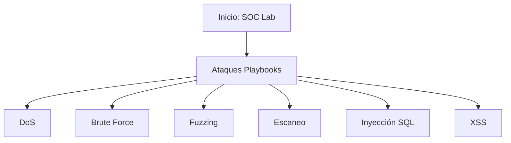

# Documentación del SOC - Laboratorio
Bienvenido a la documentación técnica de los ataques realizados en el Laboratorio SOC.

## Diagrama de Ataques

## Índice de Ataques
- [DoS Attack](../01_Playbooks/Playbook-DoS.md)
- [Brute Force (DVWA)](../01_Playbooks/Playbook-DVWA-BruteForce.md)
- [Brute Force (Hydra)](../01_Playbooks/Playbook-Hydra-BruteForce.md)
- [Fuzzing (DVWA)](../01_Playbooks/Playbook-DVWA-Fuzzing.md)
- [Fuzzing (GoBuster)](../01_Playbooks/Playbook-GoBuster-Fuzzing.md)
- [Nmap Scan](../01_Playbooks/Playbook-Nmap.md)
- [SQL Injection](../01_Playbooks/Playbook-SQLInjection.md)
- [XSS](../01_Playbooks/Playbook-XSS.md)
