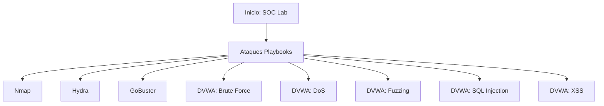

# Documentación del SOC - Laboratorio
Bienvenido a la documentación técnica de los ataques realizados en el Laboratorio SOC.

## Diagrama de Ataques

## Índice de Ataques
- [Nmap - PortScan](https://github.com/TomiGuasta/SocLab-Portfolio/tree/main/homelab-soc/docs/Nmap%20-%20PortScan)
- [Hydra - BruteForce](https://github.com/TomiGuasta/SocLab-Portfolio/tree/main/homelab-soc/docs/Hydra%20-%20BruteForce)
- [GoBuster - Fuzzing](https://github.com/TomiGuasta/SocLab-Portfolio/tree/main/homelab-soc/docs/GoBuster%20-%20Fuzzing)
- [DVWA - Brute Force](https://github.com/TomiGuasta/SocLab-Portfolio/tree/main/homelab-soc/docs/DVWA-Attacks/BruteForce)
- [DVWA - DoS](https://github.com/TomiGuasta/SocLab-Portfolio/tree/main/homelab-soc/docs/DVWA-Attacks/DoS)
- [DVWA - Fuzzing](https://github.com/TomiGuasta/SocLab-Portfolio/tree/main/homelab-soc/docs/DVWA-Attacks/Fuzzing)
- [DVWA - SQL Injection + Hashing](https://github.com/TomiGuasta/SocLab-Portfolio/tree/main/homelab-soc/docs/DVWA-Attacks/SQL%20Injection%20%2B%20Hashing)
- [DVWA - XSS](https://github.com/TomiGuasta/SocLab-Portfolio/tree/main/homelab-soc/docs/DVWA-Attacks/XSS)
